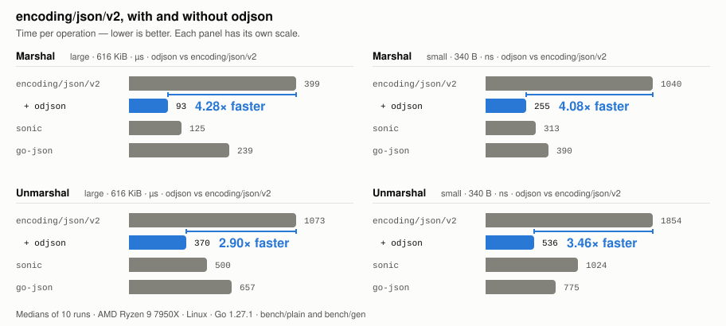

# odjson

[English](./README.md) | 日本語

[](https://github.com/mazrean/odjson/actions/workflows/ci.yml)
[](https://pkg.go.dev/github.com/mazrean/odjson)
[](./LICENSE)

**odjson**（*overdrive JSON*）は、`encoding/json/v2` をコード編集なしで [`bytedance/sonic`](https://github.com/bytedance/sonic) 相当まで高速化する CLI コードジェネレータです。
標準の `encoding/json/v2` をそのまま使って行っている JSON エンコード/デコードが、以下のコメントを追加し、`go generate` するだけで 2.9×〜3.8× 高速化します。
```go
//go:generate go tool odjson -type User
```

また、生成ファイル（`odjson_gen.go`）を削除するだけで、簡単に元の `encoding/json/v2` をそのまま使う形に戻せます。

<picture>
  <source media="(prefers-color-scheme: dark)" srcset="./docs/assets/bench-dark.svg">
  
</picture>

ベンチマーク上で、エンコード/デコードともに **`encoding/json/v2` に対して 2.9×〜3.8×** の速度向上を確認しています。また、[`goccy/go-json`](https://github.com/goccy/go-json) をいずれのベンチマークでも 1.4×〜2.3× 上回り、アセンブリを用いて JIT コンパイルや SIMD を用いる [`bytedance/sonic`](https://github.com/bytedance/sonic) も 4 つすべてで上回ります。内訳は large デコードが 1.3×、small デコードが 1.9×、2 つのエンコードが約 1.1× で、エンコードの差は実行間のばらつきに近いため同等と読むのが妥当です。

<details>
<summary>ベンチマーク環境と再現方法</summary>

ベンチマークは [`bench/`](./bench) という独立した Go モジュールにあります。`sonic` や `goccy/go-json` などの依存が `github.com/mazrean/odjson` の `go.mod` に入らないよう、分離しています。

### 再現コマンド

グラフの数値は以下のコマンドで測定し、`benchstat` で中央値を取っています。

```sh
cd bench
go test -run xxx -bench 'Benchmark(Marshal|Unmarshal)/(json-v2|go-json|sonic)/' -benchmem -count 10 ./gen/ ./plain/
```

### 測定環境

| 項目 | 内容 |
| --- | --- |
| CPU | AMD Ryzen 9 7950X |
| OS | Linux(WSL2) |
| Go | 1.27.1 |
| 実行方法 | `bench/gen` と `bench/plain` をそれぞれ 10 回実行し、中央値を採用 |
| ばらつきの確認 | [`benchstat`](https://pkg.go.dev/golang.org/x/perf/cmd/benchstat) で実施 |

### 測定対象

対象は `encoding/json` v1、`encoding/json/v2`、`sonic`、`goccy/go-json` の 4 つです。ベンチマーク名は `BenchmarkMarshal/<ライブラリ>/<入力>` と `BenchmarkUnmarshal/<ライブラリ>/<入力>` の形式になっています。
入力はいずれも [`bytedance/sonic`](https://github.com/bytedance/sonic) のベンチマークと同一のものを使用しています。

| 入力 | サイズ | 対象の Go 型 | 内容 |
| --- | ---: | --- | --- |
| `large` | 約 616 KiB | `TwitterStruct` | `twitter.json` |
| `small` | 約 340 B | `Book` | 小さな JSON |

### 測定条件

- `Unmarshal` は各反復で新しいゼロ値へ読み込みます。
- `Marshal` はあらかじめデコードした値を使います。
- 各ケースはタイマーを開始する前に 1 回ウォームアップします。
- グラフの値は別々のプロセスで測定しています。生成コードとリフレクションの差を同一プロセスで比較する場合は [`bench/ab`](./bench/ab) を使ってください。

より詳しい測定方法と実装上の前提は [bench/README.md](./bench/README.md) と [docs/internals.md](./docs/internals.md) にまとめています。

</details>

> [!IMPORTANT]
> odjson は `encoding/json/v2`/`encoding/jsontext` の内部実装に強く依存しています。このため、検証済みの Go マイナーバージョン(Go 1.27)以外では高速化が自動的に無効化され、速度が低下します。生成コードの削除のみで即座に使用を止めることもできます。

## 動作要件

Go 1.27 以降で動作します。生成コードが `encoding/json/jsontext` を import するため、1.26 以前ではコンパイルできません。

また、1.27 以降の `encoding/json` でも内部的に `encoding/json/v2` を使うため効果はありますが、`encoding/json/v2` で使用する場合に最大限効果を発揮するようにチューニングしており、`encoding/json/v2` を使うことを推奨します。`encoding/json` 経由ではエンコードが 3.4×、デコードが 1.3×〜1.6× となります。エンコードは後述の内部バッファへの直接書き込みを使いますが、デコードは公開 API を経由します。`encoding/json` が設定するコーダのフラグが、直接経路の厳密なパーサでは拒否する入力を許容するためです。

## Quick Start

まず、以下コマンドで odjson をインストールします。

```sh
go get -tool github.com/mazrean/odjson@latest
```

そして、`//go:generate` コメントを追加します。

```go
package model

//go:generate go tool odjson -type User,Post

type User struct {
	ID    int64  `json:"id"`
	Name  string `json:"name"`
	Email string `json:"email,omitempty"`
}
```

この状態で以下の `go generate` を実行すると、`odjson_gen.go` ファイルが生成されます。

```sh
go generate ./...
```

後は、`encoding/json/v2` を使えば、大幅に高速に JSON エンコード/デコードが可能になります。

```go
func handler(w http.ResponseWriter, r *http.Request) {
	var u model.User
	if err := json.Unmarshal(body, &u); err != nil {
		// ...
	}

	b, err := json.Marshal(&u)
	// ...
}
```

## インストール

`go get -tool` でのインストールを推奨します。これにより、生成コード中で使用される `github.com/mazrean/odjson/odjsonrt` も含めた `go.mod` でのバージョン管理が可能になります。
```sh
go get -tool github.com/mazrean/odjson@latest
go tool odjson -h
```

また、その他各種パッケージ管理ツールでのインストールも可能です。
<details>
<summary>単体バイナリ、Homebrew、Linux パッケージ</summary>

### バイナリ

```sh
go install github.com/mazrean/odjson@latest
```

### Homebrew（macOS）

```sh
brew install --cask mazrean/tap/odjson
```

### Linux パッケージ（Debian / Ubuntu / RHEL / Fedora / openSUSE / Alpine）

```sh
# Debian / Ubuntu
curl -LO https://github.com/mazrean/odjson/releases/latest/download/odjson_<version>_linux_amd64.deb
sudo dpkg -i odjson_<version>_linux_amd64.deb

# RHEL / Fedora / openSUSE
sudo rpm -i odjson_<version>_linux_amd64.rpm

# Alpine
apk add --allow-untrusted odjson_<version>_linux_amd64.apk
```

</details>

### フラグ

```
odjson [flags] [packages]
```

パッケージ引数を渡さない場合、カレントディレクトリのパッケージを対象に生成します。`//go:generate` から呼ぶときはこの動作を使います。

| フラグ              | デフォルト        | 説明                                                                                                          |
| ------------------- | ---------------- | ------------------------------------------------------------------------------------------------------------- |
| `-type`             | 全て             | 対象とする struct 型名をカンマ区切りで指定します。デフォルトはパッケージ内で宣言された struct すべてで、非公開の型も含みます。 |
| `-output`           | `odjson_gen.go`  | 対象パッケージのディレクトリに書き出すファイル名。パスではなくファイル名を指定します。                             |
| `-recursive`        | `true`           | 選択した型から到達できる struct 型のコーデックも生成し、ネストした値でもリフレクションを避けます。                  |
| `-escape-html`      | `true`           | 文字列中の `<`、`>`、`&` をエスケープします。`encoding/json` のデフォルトに合わせた動作です。                      |
| `-case-insensitive` | `false`          | `UnmarshalJSON` で、`encoding/json` v1 と同じく大文字小文字を無視したメンバ一致にフォールバックします。デフォルトは無効で、`encoding/json/v2` に合わせてあります。 |
| `-version`          |                  | バージョンを表示して終了します。                                                                                 |

## 仕組み

### コード生成による型ごとの専用 Marshal/Unmarshal コード生成
Go の struct は、JSON の形について必要な情報をコンパイル時にすべて持っています。`encoding/json/v2` 含む既存 JSON ライブラリはこれらを実行時に取り出し、JSON エンコード/デコードを行っています。
これに対し、odjson は struct 定義を事前に読み、型ごとの専用コードを書き出すことで大幅に高速な JSON エンコード/デコードを実現します。
具体的には、以下のようにすることで、リフレクションや中間の `map[string]any` を使わずに JSON エンコード/デコードを行います。
これにより、JIT 相当の最適化をコンパイル時に行うことができ、実行時のオーバーヘッドを大幅に削減します。

- **Marshal**: struct のフィールドをバイトスライスに直接 append
    - フィールド名、クォート、区切り文字は定数として生成ソースに埋め込む
    - [`sapphi-red/json-constantiater`](https://github.com/sapphi-red/json-constantiater) を基にした手法
- **Unmarshal**: 入力を struct のフィールドへ直接流し込む
    - reflection・中間の `map[string]any`・実行時のフィールド名ルックアップが全て不要
    - メンバ名はクォートごとドキュメントの生バイトと突き合わせる
    - bool、整数、単純な float はその場でデコードする

### 標準ライブラリに後付けする

加えて、これらの専用コードを `(T).MarshalJSONTo` / `(*T).UnmarshalJSONFrom` の標準ライブラリのインターフェースに準拠させることで、標準ライブラリを使用するコードを変更することなく、odjson の恩恵を受けることができます。
`encoding/json/v2` によりこれらのストリーム処理などによるオーバーヘッドの小さいインターフェースが提供されたことで、初めてこのような実装が可能となりました。
これにより、**標準ライブラリの信頼性**を生かしつつ、**github.com/bytedance/sonic 相当の速度**——デコードの 2 つについてはそれを上回る速度——も得ることができます。

具体的には、以下のメソッドを各型に対し追加します。

| シンボル                                        | インターフェース                                            |
| ---------------------------------------------- | ---------------------------------------------------------- |
| `(T).MarshalJSONTo` / `(*T).UnmarshalJSONFrom` | [`encoding/json/v2`](https://pkg.go.dev/encoding/json/v2) のストリーミングインターフェース。Go 1.27 で `json.Marshal` が到達する先であり、速さが出るのもここです。 |
| `(T).MarshalJSON` / `(*T).UnmarshalJSON`       | [`encoding/json`](https://pkg.go.dev/encoding/json) v1 のインターフェース。v1 のルールに従います。 |

なお、すでに `json.Marshaler`、`json.Unmarshaler`、`encoding.TextMarshaler`、`encoding.TextUnmarshaler` を実装している型には変更を加えません。これにより挙動の変化をなくせる一方、このような型は odjson の恩恵を受けられません。

また、エンコードの際に通常の経路からの `(encoding/jsontext).Encoder` への書き込みでは、書き込まれた値のバリデーションによるオーバーヘッドが大きく、十分な速度が得られませんでした。そのため、odjson では `(*encoding/jsontext).Encoder` のメモリ構造を基に内部バッファに直接書き込むことで速度を向上させています。
これにより、大幅な速度向上を実現している一方、標準ライブラリの内部構造に依存しています。そのため、この経路は検証済みの Go マイナーバージョンでのみ有効になり、それ以外では起動時に自動的に無効化され、公開 API 経由の実装にフォールバックします。この場合もコンパイルは通り、出力される JSON も変わりませんが、速度は低下します。詳細は [docs/internals.md](./docs/internals.md) を参照してください。

### その他細かい最適化

その他にも、以下のような細かい最適化を行うことで、`github.com/bytedance/sonic` 相当の速度にまで到達しています。
- `sync.Pool` によるバッファ再利用
- 専用の `float` 文字列化：桁数の少ない小数は除算1回で確定し、それ以外も `strconv` を通さず最短桁探索からワード単位で書き出す
- Word-at-a-time scanning
- UTF-8 検証の文字列スキャンへの融合による、検証パスの削減

## 導入による影響

odjson 導入では、基本的に挙動が変わることはありませんが、一部のケースで以下で説明するような挙動の変化が起きる可能性があります。

### `encoding/json` の挙動の変化

Go 1.27 以降、`encoding/json` は `encoding/json/v2` の上に実装されており、`json/v2` は型が両方のメソッドを持つ場合に `MarshalJSONTo` を優先します。このため、odjson が `encoding/json/v2` 向けに生成したエンコーダ/デコーダが使用され、一部で挙動の変化が起きます。

具体的に起きる変化は以下の通りです。
| 状況 | odjson なし | odjson あり |
| --- | --- | --- |
| nil の slice / map | `null` | `[]` / `{}` |
| nil の `[]byte` | `null` | `""` |
| `0` や `false` に対する `omitempty` | 省略される | **保持される** |
| scalar、struct、`time.Time`、`,string` フィールドへの `null`（デコード） | 変更されない | **ゼロ値になる** |
| 配列の長さの不一致（デコード） | 埋められるか切り詰められる | **拒否される** |
| メンバ名の大文字小文字が異なる場合（デコード） | 一致する | **一致しない** |
| map のメンバ順 | 名前順 | 名前順（*変化なし*） |
| `<`、`>`、`&`、U+2028/9 | エスケープされる | エスケープされる（*変化なし*） |

### Embedding 時の挙動の変化

以下のように、構造体の Embedding が行われている場合、odjson による高速化対象構造体 `A` に追加された `(T).MarshalJSONTo` / `(*T).UnmarshalJSONFrom` メソッドが `B` にも引き継がれます。
この結果、`B` に対しても `A` の JSON エンコード/デコード処理が使用されてしまい、`FieldB` が JSON のフィールドとして認識されなくなってしまいます。
```go
// A は odjson による高速化対象
type A struct {
	FieldA string `json:"field_a"`
}

// B は A を埋め込んだ構造体
type B struct {
	A
	FieldB string `json:"field_b"`
}
```

現状、このような場合には `B` も odjson による高速化対象とする必要があります。

## JSON エンコード/デコードの信頼性

odjson では `MarshalJSON` / `UnmarshalJSON` は `encoding/json`、`MarshalJSONTo` / `UnmarshalJSONFrom` は `encoding/json/v2` と完全に同じ挙動をすることを、以下のテストスイート・フィクスチャで確認しています。

- `internal/testfixture/` のパリティフィクスチャ
    - ジェネレータが扱えるフィールド形状をすべてカバー
    - あらゆる数値幅、`[]byte` と `[N]byte`、ポインタ、slice、配列、map、`any`、`json.RawMessage`、`json.Number`、`time.Time`、値およびポインタによる埋め込み、`omitempty`、`omitzero`、`,string`、`-`、非公開フィールド、自己参照型やパッケージをまたぐ型、ジェネリクス、その他のフォールバックをカバー
    - 標準ライブラリのエンコード/デコード結果と比較し、すべて同一となることを確認
- **[JSON Test Suite](https://seriot.ch/security/parsing_json.html)**（318 ケース）
    - ランタイムスキャナ/生成デコーダに対して実行
    - 標準ライブラリと同じ値を返すことを確認
- **`encoding/json` のフィールド昇格ルール**
    - `go/types` の上に再実装
    - 3 つのケースすべてに当たるよう組み立てた struct で `encoding/json` と突き合わせて確認

パリティは `go.mod` に記載のツールチェインに対して実行しています。Go 1.27 以降、`encoding/json` は v1 互換モードで `encoding/json/v2` の上に実装されており、いくつかのエスケープ形式は従来の v1 エンコーダと異なります。正確な一覧は [`odjsonrt`](https://pkg.go.dev/github.com/mazrean/odjson/odjsonrt) のパッケージドキュメントを参照してください。

## ライセンス

[MIT](./LICENSE)
